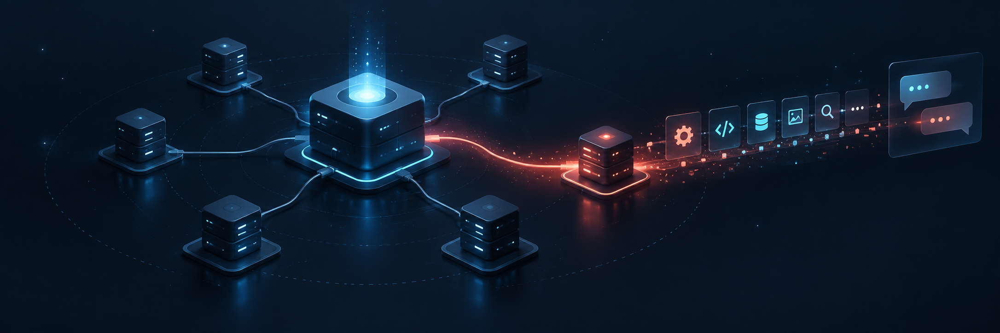

# Codex MCP Hotload



Develop MCP servers while keeping one stable connection in Codex. Add a server, rebuild it, and discover its current tools from the same conversation.

## Download version 0.2.6

Use Node.js 20 or newer. Codex will download and run the exact npm release from the configuration below. Version 0.2.6 logs tool counts and added, removed, or changed names for each Hotload child reload, and records mid-session child removal. Pinning the version keeps future releases from changing your setup unexpectedly.

To install the same version globally for terminal use, run this command.

```bash
npm install --global codex-mcp-hotload@0.2.6
```

## Connect Codex

Add this server entry to your Codex configuration file at `~/.codex/config.toml`.

```toml
[mcp_servers.codex-mcp-hotload]
command = "npx"
args = ["--yes", "codex-mcp-hotload@0.2.6", "serve"]
```

Restart Codex once after adding the gateway. The gateway stays connected while you add and reload child servers.

## Add your first server

In a terminal, register the command that starts your MCP server. Replace the example path and command with your own.

```bash
codex-mcp-hotload add my-server --cwd ~/Projects/my-server -- node dist/index.js
```

Then ask Codex to search for the child server tools and call one. When you change its code, rebuild the child and ask Codex to reload it. The gateway reads its configuration when tools are called, so a new child becomes available without restarting Codex or the gateway.

## What it supports

The gateway connects to local stdio servers and Streamable HTTP servers. It lists and searches their tools, checks arguments against the current schema, and detects when a saved schema is stale. It can watch files and rebuild a child when configured. If a stdio child exits unexpectedly, the gateway retries it with bounded backoff and reports its status. After the retry limit, calls using saved child details return a terminal error with the retry count and tell the model to stop calling until the child is manually reloaded.

Tool hashes cover names, titles, descriptions, and input and output schemas. Reload results show the old and new tool details when something changes. Search for the tool before each call and pass the returned `schemaHash`. Calls without a hash or with an old hash are rejected.

Codex native controls are available when Hotload can reach the app server control socket. By default it checks `$CODEX_HOME/app-server-control/app-server-control.sock`, or `~/.codex/app-server-control/app-server-control.sock` when `CODEX_HOME` is unset. If needed, set `codexControl.socketPath` or `codexControl.url` in the Hotload JSON configuration. A standard Desktop session may not expose this endpoint to an external process, so direct Codex discovery is optional and the gateway child features work without it.

## Native Codex controls

`hotload_list_servers` includes servers configured directly in Codex when the control endpoint is reachable. `hotload_server_status` reports their app server status. `hotload_reload_server` reloads one Hotload child or, when called without a `server`, reloads every Hotload child and requests `config/mcpServer/reload` for all Codex configured servers.

For servers managed by Hotload, the gateway keeps a stable tool interface in the chat. After a reload, call `hotload_search_tools` again and then `hotload_call_tool` with the returned schema hash; this can use changed child tools without restarting Codex. To add or remove child servers, edit Hotload's JSON config and the gateway discovers those changes on its next tool call.

For MCP servers configured directly in Codex, the reload request is global and Codex queues it for loaded threads' next active turn. Hotload reports that it queued the request, but cannot guarantee that the current chat's model tool catalog refreshed. To get same-chat dynamic access reliably, route those servers through Hotload instead of configuring them directly in Codex. This local gateway uses no paid relay or hosted service. Universal in-place replacement of Codex's own model tool schemas is not available through a supported API.

Hotload writes one-line JSON catalog events to stderr. Reload events include the before and after tool counts, sorted added, removed, and changed tool names, revision, outcome, and duration. Removing a server from Hotload's config emits a separate removal event. Tool descriptions, schemas, call arguments, and credentials are not included.

```bash
codex-mcp-hotload codex status
codex-mcp-hotload codex reload --server codex-mcp-hotload
```

In a chat, call `hotload_reload_server` with no arguments to reload all gateway children and request the Codex-wide refresh. Then search for changed child tools with `hotload_search_tools` and call them through `hotload_call_tool`.

## Develop and verify

Contributors need Node.js 20 or newer.

```bash
npm ci
npm run typecheck
npm test
npm run build
node scripts/e2e-app-server.mjs
```

The end to end check starts an isolated Codex app server and two fixture MCPs, one configured directly in Codex and one registered through Hotload. It verifies direct server discovery and the global reload request, preserves the same thread, reloads an updated child, rejects a stale schema, and checks crash recovery. It does not make a model request or need a Codex account login.

## Security

Only register child servers you trust because their commands run as your user. Keep credentials out of the configuration file and use environment variables for secrets. The gateway uses stdio and does not open a network listener.

See [SECURITY.md](SECURITY.md) for more information.
